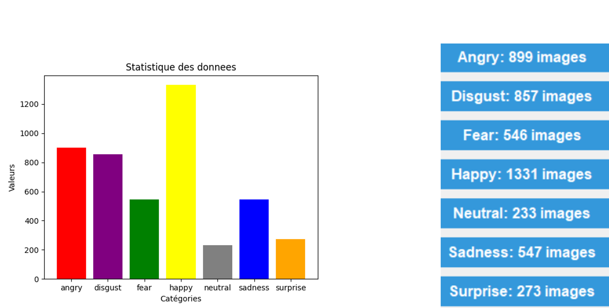
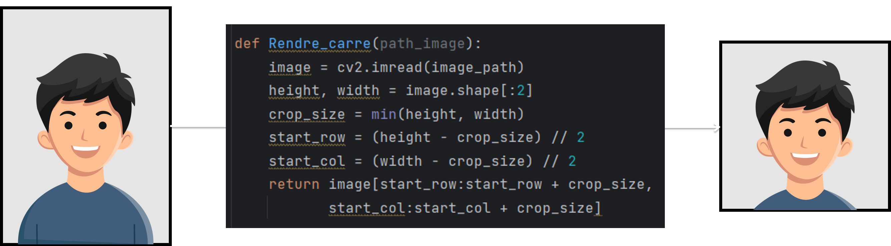
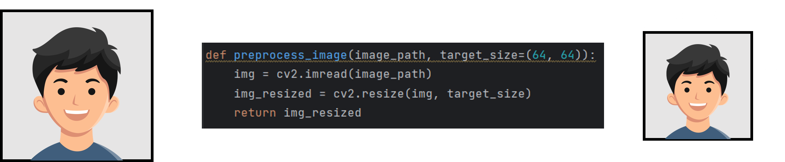
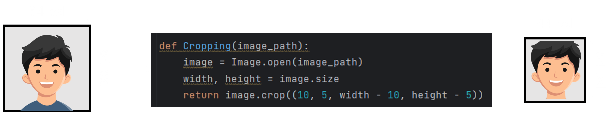
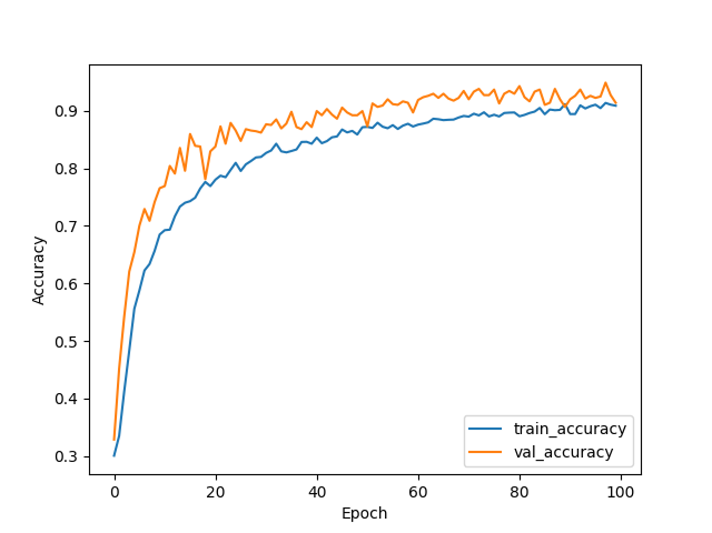

<div style="text-align: center;">

# <span style="color:#fffff">DETECTION DES EMOTIONS

### PYTHON PROJECT

</div><br>

| Realisé par: | Encadré par: |
|--------------|--------------|
| - IMANI Mourad | - ENNAJI Fatima Ezzohra |
| - ICHMAWIN Anas | |
| - BOUCHTA Othmane | |
| - FATIH Mohamed-Amine | |


## Introduction
La reconnaissance d'émotions à partir d'images constitue un domaine de recherche et d'application passionnant, alliant les disciplines de l'apprentissage profond, de la vision par ordinateur et de la psychologie. Ce projet s'inscrit dans ce contexte stimulant en visant à développer un modèle de réseau neuronal convolutionnel (CNN) capable de classifier les émotions humaines à partir d'images faciales en niveaux de gris

## EXPLORATION DES DONNÉES


## PRÉTRAITEMENT DES DONNÉES
- ### <u>Première étape</u> : rendre les images sous forme carré 



```python
def Rendre_carré(path_image):
    image = cv2.imread(path_image)
    height, width = image.shape[:2]
    crop_size = min(width, height)
    start_row = (height - crop_size) // 2
    start_col = (width - crop_size) // 2
    return image[start_row:start_row+crop_size, start_col:start_col+crop_size]
```

- ### <u>Deuxième étape</u> : redimensionnement
 



```python
def preprocess_image(image_path, target_size=(64, 64)):
    img = cv2.imread(image_path)
    img_resized = cv2.resize(img, target_size)
    return img_resized
```

- ### <u>Troixième étape</u> : cropping
 



```python
def Cropping(image_path):
    image = Image.open(image_path)
    width, height = image.size
    return image.crop((10, 5, width-10, height-5))
```

## CRÉATION D’UN MODÈLE CNN
- ### <u>Définition</u> :
    Un modèle CNN, ou Convolutional Neural Network (Réseau de Neurones Convolutif), est un type spécifique de réseau neuronal profond conçu principalement pour traiter et classer des données visuelles, telles que des images. Les CNN ont été largement utilisés et ont obtenu des succès significatifs dans des tâches telles que la reconnaissance d'objets, la détection de visages, la segmentation d'images, et bien d'autres.

## CHARGEMENT ET PRÉTRAITEMENT DES DONNÉES:
- ### <u>les bibliothèques utilisées</u> :

```python
import numpy as np
from tensorflow.keras.models import Sequential
from tensorflow.keras.layers import Conv2D, MaxPooling2D, Flatten, Dense, Dropout
from tensorflow.keras.preprocessing.image import ImageDataGenerator
from tensorflow.keras.utils import to_categorical
from sklearn.model_selection import train_test_split
from matplotlib.pyplot as plt
import cv2
import os
```
- ### <u>Code source</u> :

```python
data_path = "E:\\nouveau_pretraitement_1_1_2"
emotions_labels = ['angry', 'disgust', 'fear', 'happy', 'neutral', 'sadness', 'surprise']
# Charger les images et les étiquettes
images = []
labels = []

for emotion_label in emotions_labels:
    folder_path = os.path.join(data_path, emotion_label)
    for img_name in os.listdir(folder_path):
        img_path = os.path.join(folder_path, img_name)
        img = cv2.imread(img_path, cv2.IMREAD_GRAYSCALE) #convertir en niveaux de gris
        images.append(img)
        labels.append(emotions_labels.index(emotion_label))
```
- ### <u>Explication</u> :
Après avoir chargé et prétraité les images, le processus de normalisation des matrices d'images a été effectué afin de ramener toutes les valeurs de pixels dans une plage standardisée entre 0 et 1. Cette étape est essentielle pour garantir une cohérence dans l'échelle des données et faciliter ainsi la convergence lors de l'entraînement du modèle.<br><br>
Après l’opération “np.expand_dims(images, axis=-1)”, chaque image sera représentée par une matrice 3D au lieu d'une matrice 2D. Par exemple, si une image avait une forme de (54, 44) avant cette opération, elle aura maintenant une forme de (54, 44, 1). Cela indique qu'il y a une seule valeur d'intensité lumineuse pour chaque pixel de l'image.<br><br>
Cette étape est nécessaire car les modèles de réseau neuronal convolutionnel (CNN) de TensorFlow s'attendent généralement à des images avec une dimension supplémentaire pour le canal de couleur, même s'il s'agit d'une image en niveaux de gris avec un seul canal.<br><br>
Pour la classification des catégories, la fonction to_categorical de la bibliothèque Keras a été employée afin d'effectuer l'encodage one-hot des étiquettes. Cette étape transforme chaque étiquette représentant une émotion en un vecteur binaire. Par exemple, une image étiquetée comme "angry" est désormais représentée par le vecteur binaire [1, 0, 0, 0, 0, 0, 0]. Chaque élément du vecteur correspond à une classe spécifique d'émotion, et seul celui associé à l'émotion correcte est défini à 1, tandis que les autres sont définis à 0. Cette représentation one-hot encoding facilite la tâche du modèle lors de la classification, en permettant d'associer une probabilité à chaque classe et de sélectionner la classe avec la probabilité la plus élevée comme prédiction finale.<br><br>
le code : X_train, X_test, y_train, y_test = train_test_split(images, labels, test_size=0.2)<br>
test_size=0.2 spécifie que 20% des données seront utilisées comme ensemble de test,et 80% seront utilisées comme ensemble d'entraînement<br>
X_train: Ensemble d'entraînement des images.<br>
X_test: Ensemble de test des images.<br>
y_train: Ensemble d'entraînement des étiquettes (encodage one-hot).<br>
y_test: Ensemble de test des étiquettes (encodage one-hot)

## CRÉATION D’UN MODÈLE CNN
```python
model = Sequential()
model.add(Conv2D(32, (3, 3), activation='relu', input_shape=(54, 44 1)))
model.add(MaxPooling2D((2, 2)))
model.add(Conv2D(64, (3, 3), activation='relu'))
model.add(MaxPooling2D((2, 2)))
model.add(Conv2D(128, (3, 3), activation='relu'))
model.add(MaxPooling2D((2, 2)))
model.add(Flatten())
model.add(Dense(128, activation='relu'))
model.add(Dropout(0.5))
model.add(Dense(len(emotion_labels), activation='softmax'))

#Compiler le modele
modele.compile(optimizer='adam', loss='categorial_crossentropy', metrics=['accuracy'])
```
- ### <u>Explication des layers</u> :
    - <u>Convolutional Layers (Couches Convolutives)</u> : Les couches convolutives sont la pierre angulaire des CNN. Elles utilisent des filtres (kernels) pour extraire des motifs locaux dans les différentes parties de l'image. Ces filtres se déplacent sur toute l'image grâce à l'opération de convolution.<br>
    - <u>Pooling Layers (Couches de Pooling)</u> : Les couches de pooling sont utilisées pour réduire la dimension spatiale de la sortie des couches convolutives tout en préservant les informations essentielles. La technique la plus courante est le max pooling, qui conserve la valeur maximale dans chaque région du pooling.<br>
    - <u>Activation Functions (Fonctions d'Activation)</u> : Les fonctions d'activation, telles que ReLU (Rectified Linear Unit), introduisent de la non-linéarité dans le modèle, permettant ainsi au réseau d'apprendre des représentations plus complexes.<br>
    - <u>Fully Connected Layers (Couches Entièrement Connectées)</u> : Ces couches sont utilisées pour combiner les informations extraites par les couches convolutives et les couches de pooling pour effectuer la classification finale. Elles sont généralement situées à la fin du modèle.<br>
    - <u>Flattening</u> : Avant d'entrer dans les couches entièrement connectées, les données sont souvent aplaties (flattened) pour passer d'une représentation matricielle à une représentation unidimensionnelle.<br>
    - <u>Dropout</u> : Cette technique est souvent utilisée pour prévenir le surajustement (overfitting) en désactivant aléatoirement certains neurones pendant l'entraînement.<br>
    - <u>Input Layer (Couche d'Entrée)</u> : L'image d'entrée est généralement spécifiée comme la première couche du modèle, avec ses dimensions (largeur, hauteur, canaux).

## AUGMENTATION DES DONNÉES
```python
datagen = ImageDataGenerator(rotation_range=15, width_shift_range=0.1, height_shift_range=0.1, zoom_range=0.2)
```
- ### <u>Explication</u> :
    - <u>rotation_range=15</u> : Ce paramètre spécifie la plage de rotations aléatoires pour augmenter les images. Dans cet exemple, les images peuvent être tournées jusqu'à 15 degrés dans le sens horaire ou antihoraire.<br>
    - <u>width_shift_range=0.1 et height_shift_range=0.1</u> : Ces paramètres contrôlent le décalage horizontal et vertical aléatoire des images. Dans cet exemple, les images peuvent être déplacées horizontalement jusqu'à 10% de la largeur totale de l'image et verticalement jusqu'à 10% de la hauteur totale de l'image.<br>
    - <u>zoom_range=0.2</u> : Ce paramètre spécifie la plage de zoom aléatoire pour augmenter les images. Dans cet exemple, les images peuvent être zoomées aléatoirement jusqu'à 20%.

## ENTRAINEMENT DU MODÉLE
```python
history = model.fit(datagen.flow(x_train, y_train, batch_size=32), epochs=100, validation_data=(x_test, y_test))
```
- ### <u>Explication</u> :
    - utilisée pour entraîner le modèle avec les données d'entraînement augmentées à l'aide de l'ImageDataGenerator batch_size=32 spécifie la taille du lot, c'est-à-dire le nombre d'échantillons à utiliser pour une mise à jour des poids du modèle.<br>
    - epochs=100 : Spécifie le nombre d'itérations sur l'ensemble complet des données d'entraînement. Dans cet exemple, le modèle sera entraîné sur l'ensemble des données d'entraînement pendant 100 époques<br>
    - validation_data=(X_test, y_test) : Utilise les données de test (X_test et y_test) pour évaluer la performance du modèle à la fin de chaque époque. Cela permet de surveiller la précision et la perte du modèle sur un ensemble de données distinct pendant l'entraînement afin d'évaluer la généralisation du modèle.<br>
    - history : Cette variable stocke les métriques d'entraînement telles que la perte et la précision pour chaque époque.pour être utilisée plus tard pour visualiser l'évolution de la performance du modèle au fil du temps.

## EVALUATION DES ENTRAINNEMENTS
```python
# Evaluer le modele
test_loss, test_acc = model.evaluate(x_test, y_test)
printf(f"Test accuracy: {test_acc}")
# Enregistrer le modele entraine au format h5
model.save("C:\\Users\user\Desktop\EmotionModel.h5")
# Tracer la courbe d'apprentissage
plt.plot(history.history['accuracy'], label='train_accuracy')
plt.plot(history.history['val_accuracy'], label='val_accuracy')
plt.xlabel('Epoch')
plt.ylabel('Accuracy')
plt.legend()
plt.show()
```
## VISUALISER LES RÉSULTATS



## UTILISATION DE LA WEBCAM POUR LA DÉTECTION EN TEMPS RÉEL

- ### <u>les bibliothèques utilisées</u> :

```python
import numpy as np
import cv2
from tensorflow.keras.models import load_model
# Charger le modele a partir du fichier h5
loaded_model = load_model("C:\\Users\user\Desktop\EmotionModel.h5")
```

##  UTILISATION DE LA WEBCAM POUR LA DÉTECTION EN TEMPS RÉEL

```python
cap = cv2.VideoCapture(0)
face_cascade = cv2.CascadeClassifier(cv2.data.haarcascades + 'haarcascades_frontalface_default.xml')

while True:
    ret, frame = cap.read()
    gray = cv2.cvtColor(frame, cv2.COLOR_BGR2GRAY)
    faces = face_cascade.detectMultiScale(gray, 1.3,5)

    for (x, y, w, h) in faces:
        fc = gray[y:y + h, x:x + w]
        roi = cv2.resize(fc, (44, 54))
        pred = loaded_model.predict(roi[np.newaxis, :, :, np.newaxis])
        text_idx = np.argmax(pred)
        text_list = ['Angry','Disgust', 'Fear', 'Happy', 'Neutral', 'Sad', 'Surprise']
        text = text_list[text_idx]

        cv2.putText(frame, text, (x, y - 5), cv2.FONT_HERSHEY_SIMPLEX, 0.45, (255, 0, 255), 2)
        cv2.rectangle(frame, (x, y), (x + w, y + h), (0, 0, 255), 2)
    
    cv2.imshow("frame", frame)
    key = cv2.waitKey(1) & 0xFF
    if key == ord('s'):
        break
cap.release()
cv2.destroyAllWindows()
```
- ### <u>Explication</u> :
La dernière partie du projet réalise une détection en temps réel des émotions faciales en utilisant une webcam, OpenCV pour le traitement d'image, et TensorFlow pour charger le modèle de réseau neuronal pré-entraîné. Le programme capture continuellement des images de la webcam, détecte les visages grâce à un classificateur en cascade Haar, extrait la région du visage.<br>
puis utilise un modèle de reconnaissance d'émotions pour prédire l'émotion associée à chaque visage. Les résultats de la prédiction sont affichés en temps réel sur l'écran, accompagnés d'un rectangle entourant le visage détecté. La fonctionnalité s'arrête en appuyant sur la touche<br>
's' : stop.

- ### <u>Conclusion</u> :
Ce projet a marqué notre première incursion dans le domaine du deep learning et du machine learning. Nous avons pu explorer de nouvelles bibliothèques qui ont enrichi nos connaissances et compétences. Merci pour votre attention
